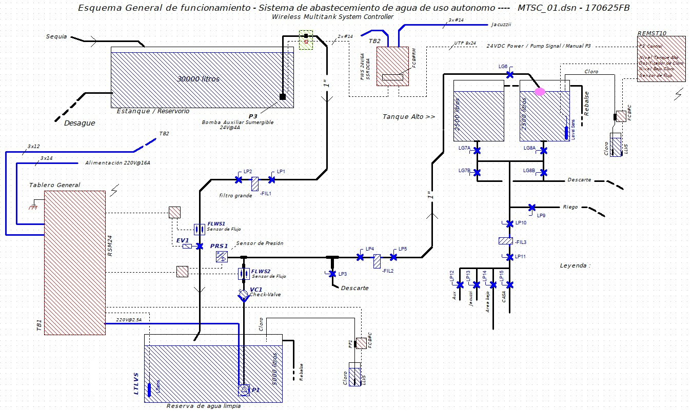
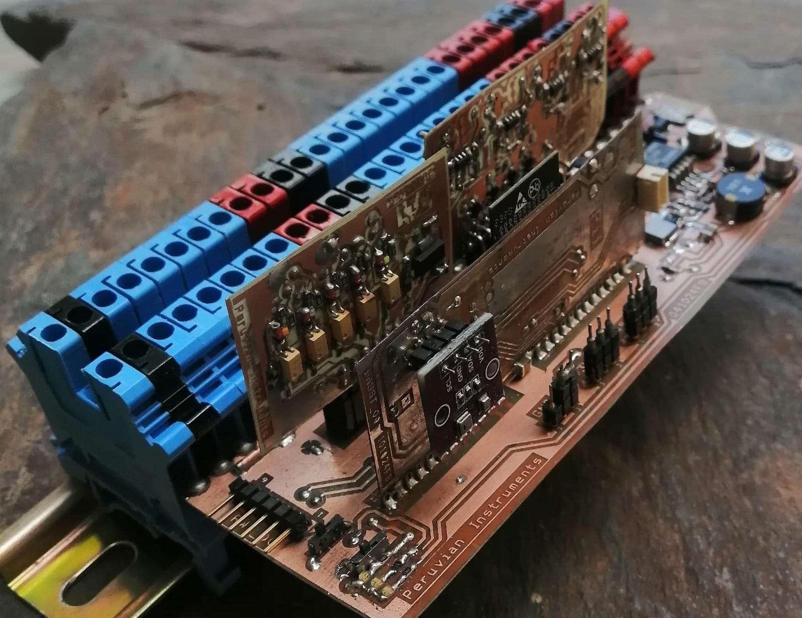
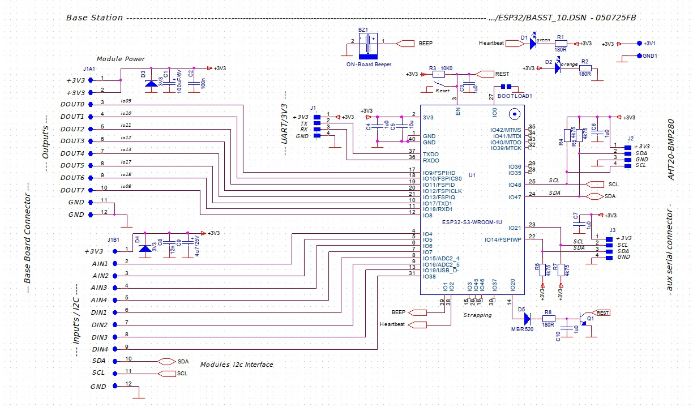
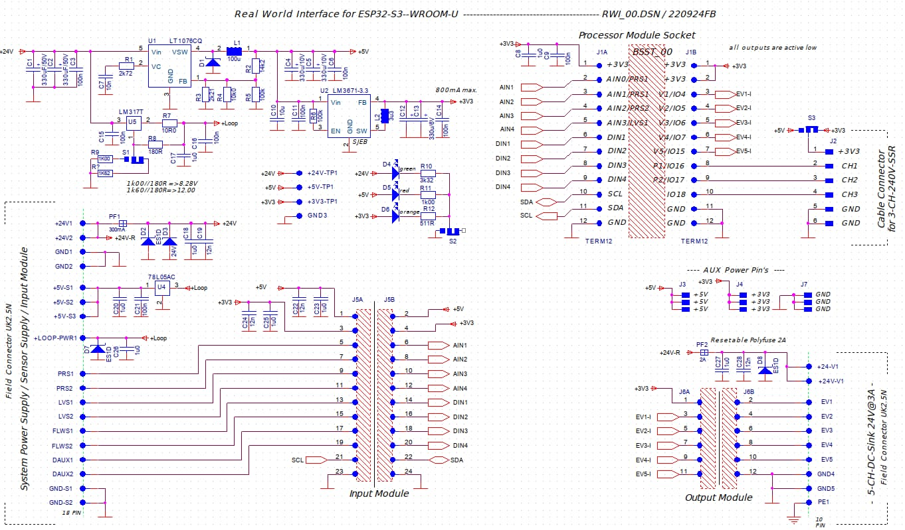
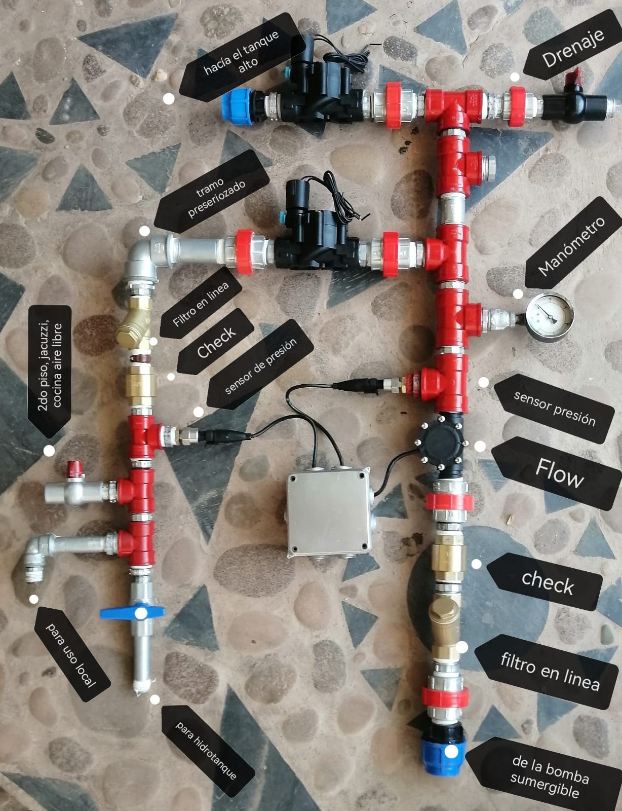
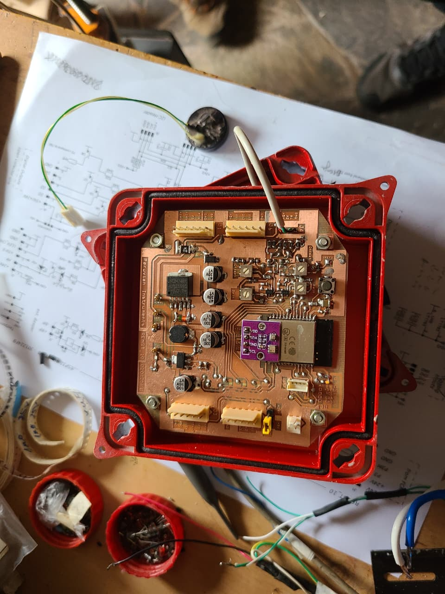
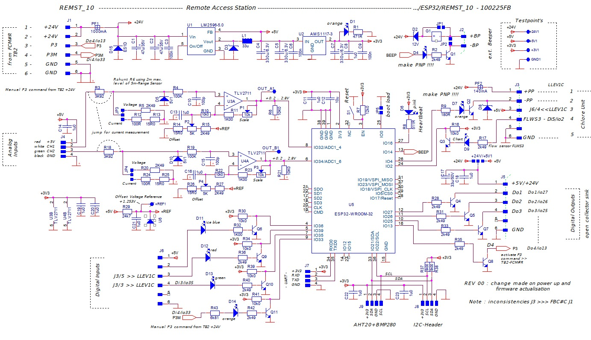
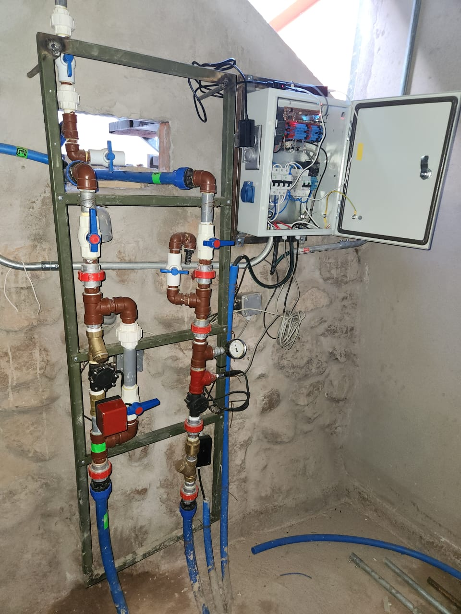

# Distributed Tank System

The Distributed Tank System is a modular IoT-based platform for monitoring and controlling multiple fluid tanks. This is a prototype system designed for research and educational purposes. It just happened to find a practical application in water tank management for a hotel/art installation.
It consists of sensor/actuator nodes, a central controller, and a dashboard app. In this case, the application of the system was for water tanks, but the architecture is meant to be adaptable to other fluids and scenarios.
The project was developed in the countryside of Peru, so it emphasizes low-cost, low-power components and wireless communication. Spanish may be used in some comments/documentation.
Errors were made, and some design choices are suboptimal, so revisions were made along the way. Feel free to ask questions, or browse through the photos in docs/images for more context.

The system is designed to be **scalable**: additional modules can be integrated, and the controller coordinates logic across the network.  
The dashboard app provides real-time data visualization and debugging capabilities.

Switching between automatic control, and manual mode is under development, along with further extensions (currently only automatic mode).

---

## Overview

This project demonstrates a distributed embedded system where multiple nodes communicate with a central controller.  
Each **node** measures tank conditions (e.g., liquid level) and reports to the **controller**, which manages logic and communication with the **dashboard app**.  
Redundancy in sensors and actuators ensures reliability.

### Features
- Modular architecture: additional tank nodes can be added.
- Wireless communication for nodes, adding flexibility for placement.
- Centralized controller for system logic and communication.  
- Robust electrical design for outdoor use, and semi-industrial environments.
- Temperature, humidity, and ambient pressure sensing for environmental monitoring, and future maintenance features.
- Dashboard app for real-time monitoring and debugging.  
- In-progress: control modes and extended features.  

---

## System Architecture

The architecture consists of:
- **Nodes**: Independent modules with sensors/actuators, implemented in Toit.  
- **Base Controller**: Central unit, implemented in Toit, coordinating nodes and serving data to the app.  
- **Dashboard App**: Kotlin application for visualization and debugging.  

Communication between components is currently based on [Wi-Fi, HTTP].

---

## Photos

- Base controller

- Water system and sensors

- Example node  

- Actual installation in Peru

---

## Repository Structure

distributed-tank-system/
│-- dashboard/ # Kotlin dashboard app
│-- system/ # Toit code (firmware for nodes and controller)
│-- docs/ # Images, diagrams, extra documentation

---

## Technology

- **Hardware**: custom PCBs, ESP32, pressure sensors, pumps, valves, flow sensors, and other components.
- **Embedded Software**: C++, Espressif firmware, Toit  
- **Dashboard App**: Kotlin (Android)  
- **Communication**: Wi-Fi, HTTP (MQTT planned)
- **Development Tools**: Toit SDK, Android Studio, old CAD software for PCB design, many other tools.

---

## Current Status

- Real-time monitoring and debugging through dashboard app – completed  
- Modular node design – completed  
- Controller logic for node coordination – completed  
- Control modes – in progress  
- Additional features (alerting, optimization, remote access) – planned  

Although the system is functional, it is a prototype and may require further refinement for production use.

---

## Future Work

- Implementation of more modes for maintenance, manual, and automatic control.
- Scaling to larger numbers of nodes.  
- Integration of additional sensor types, and AI/ML for predictive maintenance.
- Exploring security and reliability in distributed IoT systems.  

---

## License

This project is licensed under the Apache License 2.0.  
You may obtain a copy of the License at [http://www.apache.org/licenses/LICENSE-2.0](http://www.apache.org/licenses/LICENSE-2.0).

